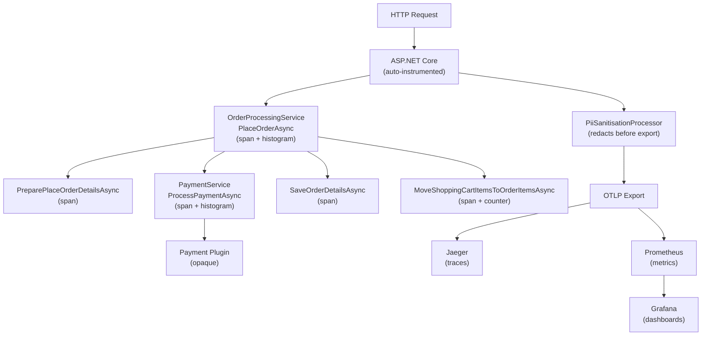

# nopCommerce — Observability & Instrumentation

OpenTelemetry-based observability for the nopCommerce order flow, with distributed tracing (Jaeger), metrics (Prometheus), and dashboards (Grafana).

## Architecture Diagram



## Prerequisites

- **Docker** & **Docker Compose**
- **k6** (for load testing) — [install guide](https://grafana.com/docs/k6/latest/set-up/install-k6/)

## Quick Start

**1. Start the application + database:**

```bash
docker compose up -d --build
```

**2. Start the observability stack:**

```bash
docker compose -f docker-compose.otel.yml up -d
```

**3. Complete the nopCommerce installation wizard** at [http://localhost](http://localhost) on first run (select MySQL, connection string: `server=nopcommerce_mysql;port=3306;user=root;password=teste123;database=nopcommerce`).

## Viewing the Dashboard

| Service    | URL                          | Notes                              |
|------------|------------------------------|------------------------------------|
| Grafana    | http://localhost:3000        | Pre-provisioned dashboard, no login required |
| Jaeger UI  | http://localhost:16686       | Search traces by service `nopCommerce` |
| Prometheus | http://localhost:9090        | Raw metrics queries                |

The Grafana dashboard **nopCommerce Order Flow** is auto-provisioned and shows order latency histograms, payment duration, error rates, and items-ordered counters.

## Running the Load Test

```bash
k6 run load-test/k6-order-flow.js
```

The test simulates the full order flow (register → add to cart → checkout) with a ramp-up to 15 virtual users. Approximately **15% of orders will fail** by design (`OTEL_SIMULATED_FAILURE_RATE=0.15`) to generate error traces and failure metrics visible in the dashboard.

## Project Structure

| Path | Description |
|------|-------------|
| `src/Libraries/Nop.Services/Diagnostics/NopCommerceDiagnostics.cs` | Shared `ActivitySource` and `Meter` definitions |
| `src/Libraries/Nop.Services/Orders/OrderProcessingService.cs` | Instrumented order processing (spans + metrics) |
| `src/Libraries/Nop.Services/Payments/PaymentService.cs` | Instrumented payment processing (spans + histogram) |
| `src/Presentation/Nop.Web/Infrastructure/OpenTelemetryStartup.cs` | OTel SDK registration via `INopStartup` |
| `src/Presentation/Nop.Web/Infrastructure/PiiSanitisationProcessor.cs` | Redacts PII from trace attributes before export |
| `docker-compose.yml` | App + MySQL database |
| `docker-compose.otel.yml` | Jaeger + Prometheus + Grafana |
| `observability/prometheus.yml` | Prometheus scrape configuration |
| `observability/grafana/provisioning/` | Grafana datasource + dashboard provisioning |
| `load-test/k6-order-flow.js` | k6 load test script |
| `load-test/dashboard.png` | Dashboard screenshot |
| `CRITIQUE.md` | Architectural critique (Task 5) |
